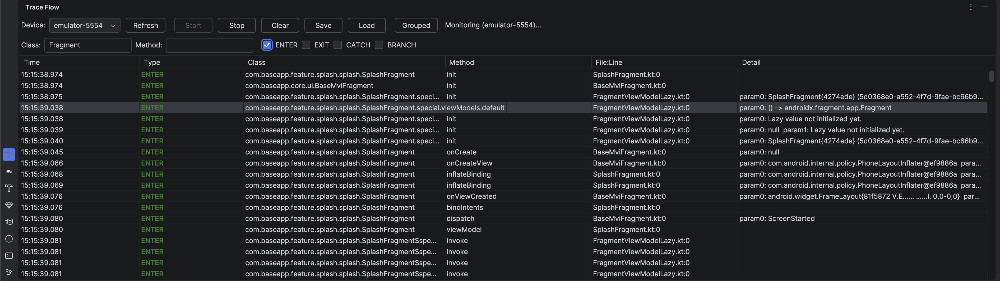
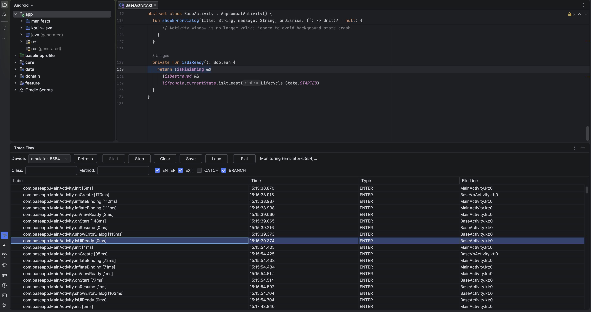
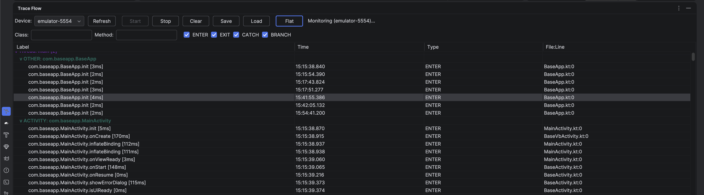

# TraceFlow

[](https://central.sonatype.com/artifact/io.github.umutcansu/traceflow-runtime)
[](https://plugins.gradle.org/plugin/io.github.umutcansu.traceflow)
[](https://plugins.jetbrains.com/plugin/30959-traceflow)
[](https://www.npmjs.com/package/@umutcansu/traceflow-runtime)

Zero-code ASM bytecode tracing for Android apps — and, as of 2.0, a
React Native / web JS runtime that posts into the same backend.
Automatically instruments every method with entry / exit / catch /
branch logging; no manual log statements needed on Android.



## Latest

| Package | Latest | Notes |
|---|---|---|
| `io.github.umutcansu:traceflow-runtime` | **2.0.1** | Maven Central |
| `io.github.umutcansu.traceflow` (Gradle plugin) | **2.0.1** | Plugin Portal |
| Android Studio plugin | **2.0.1** | JetBrains Marketplace — adds envelope grace-parse so the v2 server's `{events, nextCursor}` response shape works alongside the legacy raw-array shape |
| `@umutcansu/traceflow-runtime` | **0.2.2** | npm — `setEnabled(boolean)` runtime kill-switch (`0.2.2`); RN gzip header strip fix (`0.2.1`); `caught()` API for the babel-plugin (`0.2.0`) |
| `@umutcansu/traceflow-babel-plugin` | **0.1.3** | npm — expands destructured params (`{ user, settings }`) into their actual bound identifiers in the ENTER call, fixing Hermes `ReferenceError: Property '_destr_0' doesn't exist` on boot (`0.1.3`); skips Metro virtual polyfill files (`0.1.2`); `addNamed`-based import injection (`0.1.1`) |

Full history in [CHANGELOG.md](CHANGELOG.md).

## What's new in 2.0

- **Multi-platform ingestion** — `@umutcansu/traceflow-runtime` npm
  package ships schema-v2 trace events from React Native or web JS
  into the same TraceFlow server that Android uses. View the merged
  stream (with per-app / per-platform filters) in the IntelliJ plugin.
- **Opt-in server auth** — `TRACEFLOW_INGEST_TOKEN` gates ingest on a
  shared token; `TRACEFLOW_JWT_SECRET` gates admin endpoints on a
  Bearer JWT. Unset → open (preserves previous behaviour for demos).
- **Gzip transport** — `Content-Encoding: gzip` request bodies and
  responses, with a zip-bomb guard on the server (413 after 5 MB
  compressed / 50 MB decompressed).
- **GDPR right-to-erasure** — `DELETE /traces?userId=<id>` removes
  every event for a user.
- **Rate limits** — IP and token buckets on `POST /traces`.
- **Plugin v2 UI** — app picker (populated from `GET /apps`), platform
  and userId filters, new Platform / App columns.
- Non-breaking Android upgrade: existing `TraceLog.startRemote(...)`
  keeps working unchanged. Opt in to v2 fields via the new
  `startRemote(context, ...)` overload.

Full details: [CHANGELOG.md](CHANGELOG.md) and
[docs/migrate-v1-to-v2.md](docs/migrate-v1-to-v2.md).

## Features

### Android
- **Zero-code instrumentation** — ASM bytecode injection at compile time, no source changes required
- **Method entry/exit** — Parameters, return values, and execution duration
- **Exception tracking** — Catch blocks with try start line and exception details
- **Branch tracking** — if/else condition evaluation (optional, verbose)
- **Sensitive data masking** — Runtime masking of parameters named `password`, `token`, `pin`, `secret`, `cvv`, `ssn`
- **`@NotTrace` annotation** — Opt-out specific methods or entire classes
- **DSL auto-start** — Configure remote in `build.gradle`, auto-starts via ContentProvider — no code needed
- **Independent controls** — Toggle logcat and remote output separately at runtime
- **HTTPS enforced** — Insecure HTTP blocked by default, `allowInsecure` opt-in for development
- **Release tracing** — Optional `releaseEnabled` flag to inject tracing in release builds for field debugging

### React Native / web JS (new in 2.0)
- **Global error capture** — Unhandled exceptions and promise rejections via `ErrorUtils` (RN) or `window.error`/`unhandledrejection` (web)
- **Manual API** — `captureException(err)`, `trace(name, fn)`, `traceAsync(name, fn)`, `setUserId(id)`
- **Zero-code auto-instrumentation** — the optional [`@umutcansu/traceflow-babel-plugin`](babel-plugin/README.md) wraps every function (declarations, arrows, class/object methods, async variants) with `ENTER`/`EXIT`/`CATCH` calls at build time. No `trace()` boilerplate; this is the JS equivalent of the Android bytecode injection.
- **Gzip transport** — `CompressionStream` with optional `pako` fallback
- **Offline-safe** — Ring buffer with batch retry on failure
- **PII masking** — Stack frames, messages, and results scrubbed of `password=`, `Bearer …`, JWTs before sending
- **Device identity** — Persistent anonymous `deviceId` (localStorage / AsyncStorage); fresh `sessionId` per init

### Server + plugin
- **Android Studio plugin** — Real-time trace monitoring with manufacturer/device/tag/platform/app filtering, grouping, and source navigation
- **Remote log streaming** — Send traces to any HTTP endpoint, monitor from Android Studio without USB
- **Multi-device / multi-platform support** — Manufacturer, device model, tag, platform, app, userId columns with live filtering
- **Schema v2** — `platform`, `appId`, `userId`, `deviceId`, `sessionId`, `stack[]`, and more optional fields for cross-platform stitching

## Installation

### 1. Add the Runtime Library

<details>
<summary><b>Kotlin DSL</b> (build.gradle.kts)</summary>

```kotlin
dependencies {
  implementation("io.github.umutcansu:traceflow-runtime:2.0.1")
}
```
</details>

<details>
<summary><b>Groovy DSL</b> (build.gradle)</summary>

```groovy
dependencies {
  implementation 'io.github.umutcansu:traceflow-runtime:2.0.1'
}
```
</details>

### 2. Apply the Gradle Plugin

<details>
<summary><b>Kotlin DSL</b> (build.gradle.kts)</summary>

```kotlin
plugins {
  id("io.github.umutcansu.traceflow") version "2.0.1"
}
```
</details>

<details>
<summary><b>Groovy DSL</b> (build.gradle)</summary>

```groovy
plugins {
  id 'io.github.umutcansu.traceflow' version '2.0.1'
}
```
</details>

### 3. Install the Android Studio Plugin

**Option A — JetBrains Marketplace (recommended):**

1. Android Studio > **Settings** > **Plugins** > **Marketplace**
2. Search **"TraceFlow"**
3. Click **Install** and restart

**Option B — Manual install:**

1. Download the latest `.zip` from [JetBrains Marketplace](https://plugins.jetbrains.com/plugin/30959-traceflow)
2. Android Studio > **Settings** > **Plugins** > **Gear icon** > **Install Plugin from Disk**
3. Select the downloaded `.zip` file and restart

**Option C — Build from source:**

```bash
git clone https://github.com/umutcansu/TraceFlow.git
cd TraceFlow/studio-plugin
./gradlew buildPlugin
```
The plugin `.zip` will be in `studio-plugin/build/distributions/`. Install via Option B step 2.

### 4. Install the JS runtime (React Native / web, optional)

Only needed if you want RN or browser code to post trace events into
the same backend. The Android setup above works without it.

```bash
# Required
yarn add @umutcansu/traceflow-runtime
# Optional: gzip fallback for old Hermes / environments without CompressionStream
yarn add pako
# Recommended on RN so deviceId persists across app launches
yarn add @react-native-async-storage/async-storage
```

Minimal initialisation (add once, e.g. in `App.tsx`):

```ts
import { initTraceFlow, captureException, trace } from '@umutcansu/traceflow-runtime';

initTraceFlow({
  endpoint: 'https://traceflow.example.com/traces',
  appId: 'com.example.myapp',
  platform: 'react-native',          // or 'web-js'
  appVersion: '1.0.0',
  userId: currentUserId,
  token: process.env.TRACEFLOW_TOKEN, // only when the server enforces it
});

try { riskyWork(); }
catch (e) { captureException(e); }

const parsed = trace('parseConfig', () => JSON.parse(raw));
```

Global errors and unhandled promise rejections are captured
automatically without additional code. Full API:
[runtime-js/README.md](runtime-js/README.md).

### 5. Auto-instrument every function (optional)

If you want every function in your RN / web code to emit `ENTER` /
`EXIT` / `CATCH` events automatically — the JS equivalent of TraceFlow's
Android bytecode injection — add the Babel plugin:

```bash
yarn add -D @umutcansu/traceflow-babel-plugin
```

```js
// babel.config.js
module.exports = {
  plugins: [
    '@umutcansu/traceflow-babel-plugin',
  ],
};
```

For RN run `yarn start --reset-cache` once. From then on every
function declaration, arrow expression, class method, and async
variant in your source ships ENTER/EXIT events with no further code.
Generators are deferred. Full options matrix and what does/does not
get wrapped:
[babel-plugin/README.md](babel-plugin/README.md).

## Configuration

<details open>
<summary><b>Kotlin DSL</b> (build.gradle.kts)</summary>

```kotlin
traceflow {
  enabled = true           // master switch for bytecode injection
  releaseEnabled = false   // inject tracing in release builds too (default false)

  entry {
    logParams = true
    maskParams = listOf("password", "token", "pin", "secret")
  }

  exit {
    logReturnValue = true
    logDuration = true
  }

  statements {
    logTryCatch = true
    logBranches = false    // WARNING: very verbose
  }

  filter {
    excludePackages = listOf(
      "com.example.generated",
      "com.example.databinding",
    )
  }

  remote {
    enabled = true
    endpoint = "https://your-server.com/traces"
    tag = "my-device"
    headers = mapOf("Authorization" to "Bearer token123")
    batchSize = 10
    flushIntervalMs = 3000
    logcatEnabled = true
    allowInsecure = false
  }
}
```
</details>

<details>
<summary><b>Groovy DSL</b> (build.gradle)</summary>

```groovy
traceflow {
  enabled = true
  releaseEnabled = false

  entry {
    logParams = true
    maskParams = ["password", "token", "pin", "secret"]
    // or: maskParams "password", "token", "pin", "secret"
  }

  exit {
    logReturnValue = true
    logDuration = true
  }

  statements {
    logTryCatch = true
    logBranches = false
  }

  filter {
    excludePackages = ["com.example.generated", "com.example.databinding"]
    // or: excludePackages "com.example.generated", "com.example.databinding"
  }

  remote {
    enabled = true
    endpoint = "https://your-server.com/traces"
    tag = "my-device"
    headers = ["Authorization": "Bearer token123"]
    batchSize = 10
    flushIntervalMs = 3000
    logcatEnabled = true
    allowInsecure = false
  }
}
```
</details>

### DSL Reference

| Option | Default | Description |
|--------|---------|-------------|
| `enabled` | `true` | Enable/disable bytecode instrumentation |
| `releaseEnabled` | `false` | Inject tracing in release builds (for field debugging) |
| `entry.logParams` | `true` | Log method parameters on entry |
| `entry.maskParams` | `["password","token","pin","secret","cvv","ssn"]` | Parameter names to mask with `***` at runtime |
| `exit.logReturnValue` | `true` | Log return values on exit |
| `exit.logDuration` | `true` | Log method execution time |
| `statements.logTryCatch` | `true` | Log catch block entries with try start line |
| `statements.logBranches` | `false` | Log if/else branch evaluations (verbose) |
| `filter.excludePackages` | `[]` | Package prefixes to exclude from instrumentation |
| `remote.enabled` | `false` | Enable remote log streaming (auto-starts via ContentProvider) |
| `remote.endpoint` | `""` | HTTP endpoint URL for trace events |
| `remote.tag` | `""` | Device/session identifier for remote logs |
| `remote.headers` | `{}` | Custom HTTP headers (e.g. Authorization) |
| `remote.batchSize` | `10` | Number of events to batch before sending |
| `remote.flushIntervalMs` | `3000` | Max wait time (ms) before flushing a batch |
| `remote.logcatEnabled` | `true` | Enable logcat output (set `false` for remote-only) |
| `remote.allowInsecure` | `false` | Allow insecure HTTP endpoints (only HTTPS and localhost permitted by default) |

## Usage

### Logcat Mode (USB/ADB)

1. Open the **Trace Flow** tool window (bottom panel in Android Studio)
2. Select your device from the dropdown
3. Click **Start**
4. Run your app — trace events appear in real time

### Remote Mode (no USB required)

**Option A — DSL (auto-starts, no code needed):**
```kotlin
traceflow {
  remote {
    enabled = true
    endpoint = "https://your-server.com/traces"
    tag = "pixel-7-debug"
    headers = mapOf("Authorization" to "Bearer your-token")
  }
}
```
App starts, ContentProvider reads the config and calls `TraceLog.startRemote()` automatically.

**Option B — Programmatic:**
```kotlin
TraceLog.startRemote(
  endpoint = "https://your-server.com/traces",
  tag = "pixel-7-debug",
  headers = mapOf("Authorization" to "Bearer your-token"),
)
```

**In Android Studio:**
1. Switch to the **Remote** tab
2. Enter the same endpoint URL
3. Click **Connect**
4. Trace events stream in real time — no USB cable needed



## Runtime Controls

All controls are thread-safe (`@Volatile`) and take effect immediately.

### Runtime Properties

| Property | Type | Default | Description |
|----------|------|---------|-------------|
| `TraceLog.enabled` | `Boolean` | `true` | Master switch — disables both logcat and remote |
| `TraceLog.logcatEnabled` | `Boolean` | `true` | Controls logcat output independently |
| `TraceLog.remoteEnabled` | `Boolean` | `true` | Controls remote sending independently |
| `TraceLog.deviceTag` | `String` | `""` | Device/session identifier, changeable anytime |
| `TraceLog.maskParams` | `List<String>` | `["password","token","pin","secret","cvv","ssn"]` | Parameter names to mask with `***` |

### Control Combinations

| `enabled` | `logcatEnabled` | `remoteEnabled` | Logcat | Remote |
|-----------|-----------------|------------------|--------|--------|
| `true` | `true` | `true` | writes | sends |
| `true` | `false` | `true` | silent | sends |
| `true` | `true` | `false` | writes | silent |
| `true` | `false` | `false` | silent | silent (zero JSON overhead) |
| `false` | `*` | `*` | silent | silent (first-line return, near-zero overhead) |

### Runtime Methods

| Method | Description |
|--------|-------------|
| `TraceLog.startRemote(endpoint, ...)` | Start or restart remote sending |
| `TraceLog.stopRemote()` | Stop remote, flush pending events |
| `TraceLog.isRemoteActive()` | Check if remote is currently active |

### Parameter Masking

| Param name | `maskParams = ["password","token"]` | Logcat / Remote output |
|------------|-------------------------------------|------------------------|
| `password` | contains "password" | `password: ***` |
| `userPassword` | contains "password" | `userPassword: ***` |
| `token` | contains "token" | `token: ***` |
| `username` | no match | `username: john@mail.com` |
| `param0` (no debug info) | no match | `param0: actual_value` |

Masking is applied at runtime on both logcat and remote output. Override at runtime:

```kotlin
// Custom mask list
TraceLog.maskParams = listOf("password", "creditCard", "ssn")

// Disable masking entirely
TraceLog.maskParams = emptyList()
```

### Device Identity

Each event automatically includes device info:

| JSON Field | Source | Example |
|------------|--------|---------|
| `deviceManufacturer` | `Build.MANUFACTURER` (auto) | `"samsung"` |
| `deviceModel` | `Build.MODEL` (auto) | `"SM-G980F"` |
| `tag` | `TraceLog.deviceTag` (user-defined) | `"qa-team-1"` |

Change tag at runtime without restarting the connection:
```kotlin
TraceLog.deviceTag = "new-session-tag"
```

### Java Compatibility

All controls work identically from Java:
```java
TraceLog.enabled = false;
TraceLog.logcatEnabled = false;
TraceLog.remoteEnabled = false;
TraceLog.deviceTag = "my-device";
TraceLog.maskParams = Arrays.asList("password", "token");
TraceLog.startRemote("https://your-server.com/traces");
TraceLog.stopRemote();
```

> **Note:** Calling `startRemote()` at runtime **overrides all DSL values** (endpoint, tag, headers, etc.). To change only specific fields without restarting the connection, use properties directly (`deviceTag`, `logcatEnabled`, `remoteEnabled`).

## Release Tracing (Field Debugging)

By default, tracing is only injected into debug builds. To enable tracing in release builds for field debugging:

```kotlin
traceflow {
  releaseEnabled = true
}
```

| `enabled` | `releaseEnabled` | Debug Build | Release Build |
|-----------|-------------------|-------------|---------------|
| `true` | `false` (default) | Injection active | No injection, zero overhead |
| `true` | `true` | Injection active | Injection active, controlled at runtime |
| `false` | `*` | No injection | No injection |

When `releaseEnabled = true`, bytecode injection is present in release builds but you control activation at runtime. Typical pattern with Firebase Remote Config or your own backend:

```kotlin
class MyApplication : Application() {
  override fun onCreate() {
    super.onCreate()
    if (!BuildConfig.DEBUG) {
      TraceLog.enabled = false  // silent until activated
      // Activate from backend when needed
      fetchRemoteFlag { shouldTrace ->
        if (shouldTrace) {
          TraceLog.enabled = true
          TraceLog.startRemote("https://your-server.com/traces")
        }
      }
    }
  }
}
```

## Studio Plugin Features



### Views

| View | Description |
|------|-------------|
| Flat | Chronological event table with sortable columns |
| Grouped | Tree hierarchy: Thread > Activity/Fragment > methods (expand/collapse) |

### Filters

| Filter | Type | Description |
|--------|------|-------------|
| Manufacturer | Dropdown | Filter by device manufacturer (samsung, google, etc.) |
| Device | Dropdown | Filter by device model + tag |
| Tag | Text | Filter by user-defined session tag |
| Class | Regex | Filter by class name (e.g. `.*Fragment$`) |
| Method | Regex | Filter by method name (e.g. `on(Create\|Resume)`) |
| Date range | From / To | Filter events by time window |
| Event type | Checkboxes | ENTER, EXIT, CATCH, BRANCH |

### Columns

| Column | Default visible | Description |
|--------|----------------|-------------|
| Date | yes | Event date (yyyy-MM-dd) |
| Time | yes | Event time (HH:mm:ss.SSS) |
| Type | yes | ENTER / EXIT / CATCH / BRANCH (color-coded) |
| Class | yes | Class name |
| Method | yes | Method name |
| File:Line | yes | Source file and line number |
| Manufacturer | no | Device manufacturer |
| Device | no | Device model |
| Tag | no | User-defined tag |
| Detail | yes | Parameters, return values, exceptions |

### Other Features

| Feature | Description |
|---------|-------------|
| Source navigation | Double-click any event to jump to the source line |
| Smart auto-scroll | Follows new events at bottom, stays put when scrolled up |
| Session export | Save traces as JSON (preserves device info) |
| Session import | Load JSON or raw logcat files |
| Color-coded events | ENTER (green), EXIT (blue), CATCH (red), BRANCH (amber) |
| Live device detection | New manufacturers/devices auto-appear in filter dropdowns |

## Log Output

Every traced method produces dual-format output:

**Human-readable (logcat):**
```
D/TraceFlow ENTER: [LoginViewModel] reduce()  src:LoginViewModel.kt:42
                     password: ***
                     username: test@mail.com

D/TraceFlow EXIT : [LoginViewModel] reduce  [3ms]  src:LoginViewModel.kt:42

W/TraceFlow CATCH: [AuthRepository] login  src:AuthRepository.kt:67
                     try started: line 58 -> catch: line 67
                     SocketTimeoutException: Connect timed out
```

**Structured JSON (for plugin and remote):**
```json
{
  "type": "ENTER",
  "class": "LoginViewModel",
  "method": "reduce",
  "file": "LoginViewModel.kt",
  "line": 42,
  "threadId": 2,
  "threadName": "main",
  "ts": 1712000000000,
  "deviceManufacturer": "samsung",
  "deviceModel": "SM-G980F",
  "tag": "qa-team-1",
  "params": { "username": "test@mail.com", "password": "***" }
}
```

## `@NotTrace`

Exclude specific methods or entire classes from tracing:

```kotlin
@NotTrace
class GeneratedHiltModule { ... }

class LoginViewModel {
  @NotTrace
  private fun validateEmail(value: String): Boolean { ... }
}
```

## Remote Streaming API

### Server Requirements

Your server must implement two endpoints:

| Endpoint | Method | Description |
|----------|--------|-------------|
| `/traces` | `POST` | Receives JSON array of trace events |
| `/traces?since={ts}` | `GET` | Returns events after given timestamp |

### Sample Server

A ready-to-use Ktor server is included in `sample-server/`:

```bash
cd sample-server
./gradlew run
```

The server starts on port **4567** by default (override with `PORT` env variable) and provides:

| Endpoint | Method | Description |
|----------|--------|-------------|
| `/` | `GET` | Health check |
| `/traces` | `POST` | Receive trace events |
| `/traces?since={ts}` | `GET` | Poll events after timestamp |
| `/traces` | `DELETE` | Clear all events |
| `/stats` | `GET` | Event counts by device and type |

### Security

| Endpoint | `allowInsecure` | Build | Runtime |
|----------|-----------------|-------|---------|
| `https://api.example.com` | `false` | builds | connects |
| `http://127.0.0.1:4567` | `false` | builds (localhost exempt) | connects |
| `http://10.0.2.2:4567` | `false` | builds (emulator exempt) | connects |
| `http://192.168.1.80:4567` | `false` | **GradleException** | **IllegalArgumentException** |
| `http://192.168.1.80:4567` | `true` | builds (with warning) | connects (with warning) |

For local development with HTTP:
```kotlin
// DSL
traceflow {
  remote {
    enabled = true
    endpoint = "http://192.168.1.80:4567/traces"
    allowInsecure = true
  }
}

// Runtime
TraceLog.startRemote(
  endpoint = "http://192.168.1.80:4567/traces",
  allowInsecure = true,
)
```

## Built-in Exclusions

The following are automatically excluded from instrumentation:

- Dagger/Hilt generated classes (`Dagger*`, `Hilt_*`, `*_Factory`, `*_MembersInjector`)
- Data binding classes
- Kotlin synthetic accessors and default stubs
- Property getters/setters
- The TraceFlow runtime itself

## Self-hosting the server

The `sample-server` is a Ktor app that accepts trace events from every
runtime. Out of the box it binds to port 4567 and stores events in
SQLite (`traceflow.db`). The new opt-in security controls live behind
environment variables:

| Variable | Effect when set |
|---|---|
| `TRACEFLOW_INGEST_TOKEN` | `POST /traces` requires `X-TraceFlow-Token: <value>` (constant-time comparison) |
| `TRACEFLOW_JWT_SECRET` | Admin endpoints (`GET /traces`, `/apps`, `/stats`, `DELETE /traces`) require `Authorization: Bearer <jwt>` (HMAC-256) |
| `TRACEFLOW_JWT_ISSUER` | JWT issuer claim (default `traceflow`) |
| `TRACEFLOW_JWT_AUDIENCE` | JWT audience claim (default `traceflow-admin`) |
| `PORT` | Bind port (default `4567`) |
| `DB_PATH` | SQLite file path (default `traceflow.db`) |

Rate limits: 600 ingest req/min per IP, 10 000 per token (opt-in
only when a token is configured). Zip-bomb guard: bodies over 5 MB
compressed or 50 MB after gunzip are rejected with HTTP 413.

Always terminate TLS in front of the server (nginx / Caddy /
Cloudflare) before exposing it to the public internet — the
sample-server itself serves plain HTTP on purpose, so that local
development and behind-VPN deployments stay simple.

### GDPR

`DELETE /traces?userId=<id>` removes every event for a user,
admin-auth when enabled. See
[docs/migrate-v1-to-v2.md](docs/migrate-v1-to-v2.md) for full
operator notes.

## Architecture

```
TraceFlow/
├── runtime/        -> Android library: TraceLog + @NotTrace (Maven Central)
├── gradle-plugin/  -> Gradle plugin: ASM bytecode injection (Gradle Plugin Portal)
├── studio-plugin/  -> Android Studio plugin: trace viewer (JetBrains Marketplace)
├── runtime-js/     -> React Native / web JS runtime (npm)
├── babel-plugin/   -> Babel plugin: auto-instrument JS/TS functions (npm)
├── sample-server/  -> Ktor sample server for remote log streaming
└── docs/           -> Design docs, v2 migration, product vision
```

## Requirements

- Android Gradle Plugin 8.0+
- Kotlin 1.9+
- Android Studio Ladybug (2024.2) or newer
- minSdk 21+

## License

Apache License 2.0
